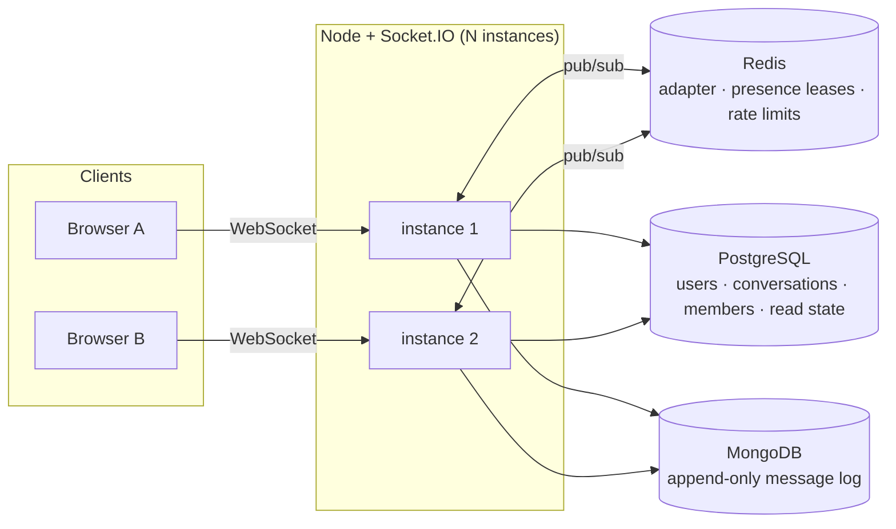

# Relay

**Horizontally-scalable realtime chat — Socket.IO + Redis pub/sub adapter, at-least-once delivery, PostgreSQL + MongoDB polyglot persistence.**

<!-- TODO: demo GIF goes here, above everything. Two browser windows side by side,
     each showing a DIFFERENT instance id in the connection banner, with a message
     crossing between them. Most people who evaluate this will read only this far. -->

<!-- TODO: live demo link + "log in as demo1 / demo2, password demo1234" -->

---

## What makes this different from a tutorial chat app

Most chat demos stop at "message appears in the other window". The interesting problems start after that — what happens when the recipient is offline, when the network drops mid-send, when there is more than one server, when a server dies holding state. This project is built around those four questions.

- **Runs on many instances at once.** Fan-out goes through a Redis pub/sub adapter, so a message reaches members connected to any server. Each instance reports its own id, and the UI shows it — two windows on two instances is a visible fact, not a claim.
- **At-least-once delivery with an exactly-once effect.** Every message carries a client-generated idempotency key. Retries are safe: a unique index turns a duplicate send into a no-op that returns the message already stored.
- **An offline queue with no queue.** There is no queue table and no Redis list. The append-only message log *is* the queue; each member has a high-water mark into it. An offline user is simply a cursor that has fallen behind.
- **Presence that cannot leave ghosts.** Presence is a TTL lease refreshed by a heartbeat, not a row. Kill a server and its users age out in 45 seconds. There is no cleanup job because there is no durable state to clean.

---

## Architecture



Clients connect to whichever instance a load balancer picks. `io.to(room).emit()` publishes to Redis; every instance delivers to its own local sockets in that room. No instance needs to know where anyone else is connected.

---

## Why two databases

> The two stores have different access patterns and different consistency needs. Identity, membership and read state are small, highly relational, and need transactional integrity — a non-member must not be able to post, a DM must be unique per pair, refresh-token rotation must be atomic — so that is PostgreSQL, with foreign keys and unique constraints doing the enforcing instead of application code. Messages are the opposite: append-only, unbounded, never updated, never joined, and always read by the same key — conversation plus a sequence range. That is a log, not a relation. MongoDB gives a natural shard key in `conversationId` and a document shape that can absorb attachments and reactions without a migration on the highest-volume collection.
>
> The seam between them is a single integer. PostgreSQL allocates a per-conversation sequence number in the same statement that bumps `last_message_at`, and that `seq` is the only thing the message store needs to know about the relational world. It is also what makes ordering, unread counts and redelivery work without ever scanning the messages.

**"Isn't that a distributed transaction?"** No, and it does not pretend to be one. Sequence allocation is the only PostgreSQL write on the send path. If the MongoDB insert then fails, the effect is a burned sequence number — a gap. Gaps are expected anyway, from soft deletes and from retries, so the client treats a gap as *fetch this range*, never as *data lost*. The invariant needed is that `seq` is **monotonic**, not contiguous, and a single `UPDATE … RETURNING` under a row lock guarantees that.

---

## How a message is delivered

```mermaid
sequenceDiagram
    participant C as Client
    participant S as Server
    participant PG as PostgreSQL
    participant MG as MongoDB
    participant R as Redis

    C->>C: clientMsgId = uuid(); render optimistically; save to outbox
    C->>S: message:send {conversationId, body, clientMsgId}
    S->>S: authorise from signed token (never the payload)
    S->>R: rate-limit check
    S->>PG: UPDATE conversations SET next_seq = next_seq+1 RETURNING seq
    S->>MG: insert {seq, clientMsgId, …}
    Note over MG: unique (senderId, clientMsgId)<br/>a retry hits E11000 instead of duplicating
    S->>R: publish to conv room
    R-->>S: every instance delivers to its local sockets
    S-->>C: ack {ok, message}
    C->>C: replace optimistic bubble; drop from outbox
```

If the ack never arrives — timeout, dropped socket, server restart — the message stays in the client's outbox and is re-sent on reconnect with the **same** `clientMsgId`. That is the whole contract in one sentence.

---

## Reliability guarantees

| Guarantee | How |
|---|---|
| **At-least-once delivery** | Client outbox persisted to localStorage, re-sent on reconnect; server watermark advances only on explicit ack |
| **Exactly-once effect** | Unique index on `(senderId, clientMsgId)`; a duplicate send returns the stored message |
| **Per-conversation ordering** | `seq` allocated under a row lock, monotonic but **not** contiguous |
| **No message loss on crash** | A client that dies before acking a backlog receives it again on reconnect |
| **Presence eventually consistent within 45s** | Redis TTL leases refreshed by a per-instance heartbeat |

The client de-duplicates on arrival, because the same message legitimately arrives twice — once as a live broadcast, once in a reconnect backlog. That redundancy is the protocol working, not a defect.

---

## Measured performance

Run it yourself: `npm run loadtest -- --users 100 --senders 5 --duration 20000`

| | 1 instance, 100 clients | 3 instances, 150 clients |
|---|---|---|
| Connections established | 100 / 100 | 150 / 150 |
| Connect time p50 / p95 | 1319 / 1715 ms | **1122 / 1531 ms** |
| Ack round-trip p50 / p95 | 264 / 845 ms | **257 / 466 ms** |
| Fan-out latency p50 / p95 | 261 / 843 ms | 324 / **466** ms |
| Deliveries observed | 9 405 | 14 155 |
| Delivery throughput | 470 /s | **708 /s** |
| Errors / timeouts | 0 | 0 |

Three instances serving 150 clients beat one serving 100 on every measure that matters — 50% more deliveries per second and roughly half the tail latency. That is the claim this project exists to demonstrate, measured rather than asserted.

**The remaining ~260 ms is the load generator's own network path, not the server.** Each send makes three sequential round trips, and a single round trip from the test machine to Singapore is ~83 ms. Three of those is ~250 ms, which accounts for essentially all of it. Deployed in the same region as the databases, this cost disappears.

*Measured from a Windows laptop in India against managed databases in `ap-southeast-1`, with server processes, load generator and client sockets all in one process. This measures the application plus a home internet connection, not a production deployment.*

### Two measurements that changed the design

**The connection pooler was costing 325 ms per query.** Neon's pooled endpoint benchmarked at 407 ms median for `SELECT 1`; the direct endpoint at 83 ms. The app now uses the direct endpoint, and the reasoning generalises: a pooler solves a problem this application does not have. PgBouncer exists for serverless runtimes that open a connection per invocation — here there are long-lived Node processes and Prisma already pools internally, so the pooler was a second pool in series. Fixing this alone took the 5-sender p95 from 4829 ms to 460 ms.

**A hypothesis the numbers killed.** The send path originally did a pre-emptive "have I seen this `clientMsgId`?" read, to avoid burning a sequence number on a retry. It looked like an obvious per-message cost, so it was removed — and the numbers did not move at all. It was never the bottleneck. The read stayed removed, since it is strictly fewer round trips for identical guarantees, but the fix came from the measurement rather than the guess, and the guess was wrong.

**On the per-conversation row lock.** `UPDATE conversations SET next_seq = next_seq + 1` serialises concurrent sends in one conversation, and with a 400 ms pooled query in the critical section that dominated everything — 10 senders measured 4959 ms. With the lock now held for ~80 ms instead, contention is no longer the limiting factor: 5 concurrent senders are indistinguishable from 1. It remains the first thing that would need to change under real load, and the fix is a Redis `INCR` with periodic PostgreSQL checkpointing, accepting larger gaps after an eviction.

---

## Testing

**53 tests**, run with `npm test`. The suite talks to real PostgreSQL, MongoDB and Redis — `ioredis-mock` is deliberately not used, because cross-client pub/sub is precisely what needs verifying.

`tests/integration/reliability.test.js` boots **two real server instances** on ephemeral ports, each with its own Redis pub/sub pair, and drives them with real Socket.IO clients:

1. The same `clientMsgId` sent twice stores exactly one document; the duplicate is not rebroadcast.
2. Messages sent while the recipient has no socket arrive in the backlog on connect.
3. An acknowledged backlog is never resent.
4. **A client that receives a backlog and dies without acking gets it again on reconnect** — and exactly one copy is stored. This is the test that answers *how do you know it is at-least-once?*
5. Missing, forged and expired handshake tokens are all rejected, with `TOKEN_EXPIRED` distinguished.
6. A non-member's send is refused, and a `senderId` injected into the payload is ignored in favour of the signed token.
7. A message sent on instance A reaches a client on instance B, with the two instance ids asserted to differ.
8. Ten concurrent sends receive strictly increasing, non-duplicated sequence numbers.

**Deliberately not covered:** React component tests, end-to-end browser tests, coverage thresholds. A stated scope beats a silent absence.

---

## Security

- **Access tokens** are short-lived JWTs held **in memory only**, never localStorage. XSS can still read one, but the blast radius is one tab for fifteen minutes rather than a token sitting in storage for any later script to find.
- **Refresh tokens** are opaque random bytes, never JWTs, stored only as a SHA-256 hash, in an `httpOnly` cookie. A database leak yields no usable sessions.
- **Rotation with reuse detection.** Every refresh burns the presented token. Presenting one twice means a stolen copy is being replayed — and since thief and victim are indistinguishable, the whole token family is revoked. That caps a theft at one refresh cycle instead of seven days.
- **Socket handshakes are authenticated**, and a 60-second sweep disconnects sockets whose token has aged out. Without it a long-lived WebSocket silently converts a 15-minute token into an unbounded session.
- **The app is same-origin in both dev and production** — Vite proxies in dev, Express serves the build in production — so there is no CORS configuration anywhere and the refresh cookie stays first-party.
- **XSS.** The predecessor to this project rendered messages with `innerHTML` and no escaping, giving a stored XSS that fired for every future visitor. JSX escapes by default, so it is gone — but "the framework handles it" is not a security control, so `react/no-danger` is an ESLint **error**, `helmet` is enabled, and message length is validated server-side.

---

## Known limitations, and what I would do next

- **Sequence allocation is a per-conversation hot row.** Measured above. Strict ordering is worth it at this scale; Redis `INCR` with PostgreSQL checkpointing is the escape hatch.
- **Fan-out on write.** Every message is pushed to every member's sockets. Fine for small conversations, wrong for a 10 000-member channel.
- **No end-to-end encryption.** Messages are readable by the server.
- **No attachments or media** — the document shape anticipates them, but presigned-upload plumbing is not built.
- **No message search.** A MongoDB text index on `body` is the obvious next step.
- **Presence is per-user, not per-device.** You are online or not; which device is not exposed.
- **WebSocket transport only**, so there is no fallback for proxies that block it. That is the price of not needing sticky sessions.
- **Sender display names are not denormalised** into messages. If history reads became the bottleneck, storing a sender snapshot would be the trade — accepting stale names after a rename.

---

## Running it locally

```bash
npm install
cp .env.example .env        # fill in the three connection strings
npm run migrate             # apply the schema
npm run seed                # demo1 / demo2 / demo3, password "demo1234"
npm run dev:server          # API + sockets on :3000
npm run dev:client          # UI on :5173
```

Open <http://localhost:5173> in two different browsers and log in as `demo1` and `demo2`.

To see horizontal scaling, run a second instance against the same Redis and point one browser at each:

```bash
PORT=3001 npm run dev:server
```

The connection banner shows which instance each browser is on.

### Environment

| Variable | Purpose |
|---|---|
| `DATABASE_URL` | PostgreSQL, **pooled** endpoint (`pgbouncer=true`) |
| `DIRECT_URL` | PostgreSQL, unpooled — migrations only |
| `MONGO_URL` | MongoDB connection string |
| `REDIS_URL` | Redis, **TCP** endpoint. Upstash's HTTP/REST API does not support pub/sub and will not work |
| `JWT_SECRET` | 32+ characters |
| `BCRYPT_ROUNDS` | Default 12 |

---

## Project layout

```
server/
  prisma/schema.prisma        users · conversations · members · refresh tokens
  src/models/                 the Mongoose message log
  src/http/                   REST: auth, conversations, history, user search
  src/realtime/               socket.io: adapter, handshake auth, handlers
  src/services/               message · conversation · sync · presence · tokens
  tests/integration/          the reliability contract, executable
client/
  src/store/                  auth, chat state, the outbox
  src/realtime/socket.js      dedup, gap repair, resend-on-reconnect
  src/components/             conversation list, message list, composer
loadtest/socket-load.js       the numbers above
docs/                         plan and build log, including every deviation
```
